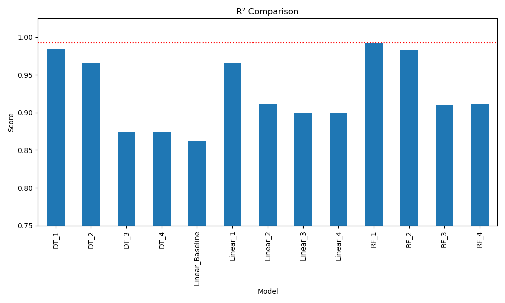

# Diamond Pricing

This repository holds an attempt to apply machine learning methods to model and predict the price of diamonds using data from the ["Diamonds"](https://www.kaggle.com/datasets/shivam2503/diamonds/data) Kaggle dataset.

## Overview

The purpose of this project was to use the data provided from the Kaggle dataset about different diamonds to predict their prices. The given variables were a mix of numerical and categorical and included carat, color, and dimensions of approximately 54,000 diamonds. This was a regression task, and several different regression-oriented models were tested in two rounds, including linear regression, polynomial regression, and tree-based models. Model performance was verified and evaluated through visualizations, such as residual and performance plots, statistical metrics, such as R² and root mean squared error (RMSE), and further scrutinized with cross-validation. The best model, in terms of raw statistical metrics was a Random Forest model, achieving an R² value of 0.992; however, the strongest candidate was arguably a polynomial regression model, which had a comparable R² value of 0.986 and proved to be more consistent and resistant to bias.

## Data

Type: Tabular data, both categorical and numerical, describing the characteristics of diamonds, along with their prices.
Size: 53,940 entries and 10 features
Instances (Train, Test, Validation Split): an 80/20 train-test split was done for the first round of models, and then a 75/25 split was done in the second round. 5-fold cross validation was applied during the latter.

## Preprocessing / Clean up

In preprocessing the data, many methods were applied. An unnecessary index column was removed; no imputatation was necessary because there were no null or missing values. The categorical features were label encoded, since many provided information on quality or sequences, rather than one-hot encoded. Extreme outliers and nonsense entries were trimmed. Some numerical columns were binned and encoded, and the remaining numerical columns were normalized. More details of this process can be seen in the "Diamond_Pricing" notebook.

### Visualization

#### Correlation Matrix of Numerical Features.

The initial correlation matrix made of the features in the dataset showed that many of them were highly correlated, indicating early on that there may be multicollinearity in the data.

#### Linear Baseline Model

An initial baseline model was run on the raw data, before any significant preprocessing, which yielded an RMSE of 1477.914 and R² of 0.864. This was part of the initial survey of data and to have a reference to look back on and compare future models to. The R² was relatively high, which further gave indication of possibly multicollinearity, and also prefigured model overfitting.

## Problem Formulation

The inputs were the various characteristics and given attributes of the diamonds, such as their cut, clarity, dimensions, etc., and the target variable, or output, was the price of the diamonds. This was a regression task. In the first round of modelling, linear regression, decision tree, and random forest were all utilized. Different iterations of each were done with different subsections of the cleaned dataset. During the second round ("Diamonds_ModelDeepDive"), polynomial regression was also added, since the tree models seemed to be inconsistent and overfitting, while the linear regression seemed to be too simple. Polynomial regression proved to be a good balance. 

## Performance Comparison

The key performance metrics were the R² and RMSE. Residual plots and performance plots (during the second round) were also used and compared to evaluate model performance. Initially, random forest performed best, with an R² value of 0.992, and the lowest RMSE value, however this was likely overfit. This issue was attempted to be rectified within the second round, where cross-validation was utilized to get an average R² across folds. The tree-based models proved to be inconsistent across different train-test cuts, whereas the linear regression performed more consistently. Interestingly, every model's R² score seemed to "dip" at a certain section of the cross-validation. This led to the decision to use a polynomial regressor to improve on the basic linear regression and also avoid the pitfalls of the tree-based models. 

#### Metrics of all models of initial round of modelling.

#### R² comparison between models of first round of modelling.

#### Average R² comparison of models after cross-validation.

#### Comparison of RMSE values across most models.

## Conclusions

Although the Random Forest model performed the best on the initial run, a deeper study revealed that it was not as rigorous as initially thought and was likely overfitting to the data. The best model proved to be the polynomial regressor with a degree of 2, which was resistant when tested with cross-validation and could almost match the initial random forest while generalizing to the data much more effectively.

## Future Work

In the future, I'd like to explore better feature selection and preprocessing techniques, as well as further investigating in the observed "gap" in the data, which also could have been causing the aforementioned "dip" in the cross-validation. I'd like to explore how different models react with the data; for example since tree-based models seemed ill-fit, perhaps higher orders of polynomials or ridge/lasso regressors would perform better, and perhaps salvaging tree-based models with hyperparamater tuning could also be explored.

## How to Reproduce Results

To reproduce the analysis and modeling results:

- Clone this repository.
- Open Diamond_Pricing.ipynb using Jupyter Notebook or Jupyter Lab.
- Download datasets in the same directory as the notebook.
- Run all cells.
- Repeat with Diamond_ModelDeepDive.ipynb

All necessary data loading, preprocessing, and model evaluation steps are included in the notebooks. 

## Contents of Repository

- diamonds.csv: Raw dataset downloaded from Kaggle.
- diamonds_processed.csv: Preprocessed version used in modeling.
- Diamond_Pricing.ipynb: contains data exploration, visualizations, and preprocessing, as well as the initial round of modelling, including performance comparisons.
- Diamond_ModelDeepDive.ipynb: contains second round of modelling, performance comparisons, and fine-tuning.

## Software Setup

Packages used:
- pandas
- numpy
- matplotlib.pyplot
- seaborn
- sklearn
- scipy

## Data
The dataset used can be downloaded from the [Kaggle page](https://www.kaggle.com/datasets/shivam2503/diamonds/data) or directly from this repository:

- diamonds.csv: Raw dataset downloaded from Kaggle.
- diamonds_processed.csv: Preprocessed version used in modeling.

The process for generating the clean dataset was documented in the Diamond_Pricing.ipynb notebook.

